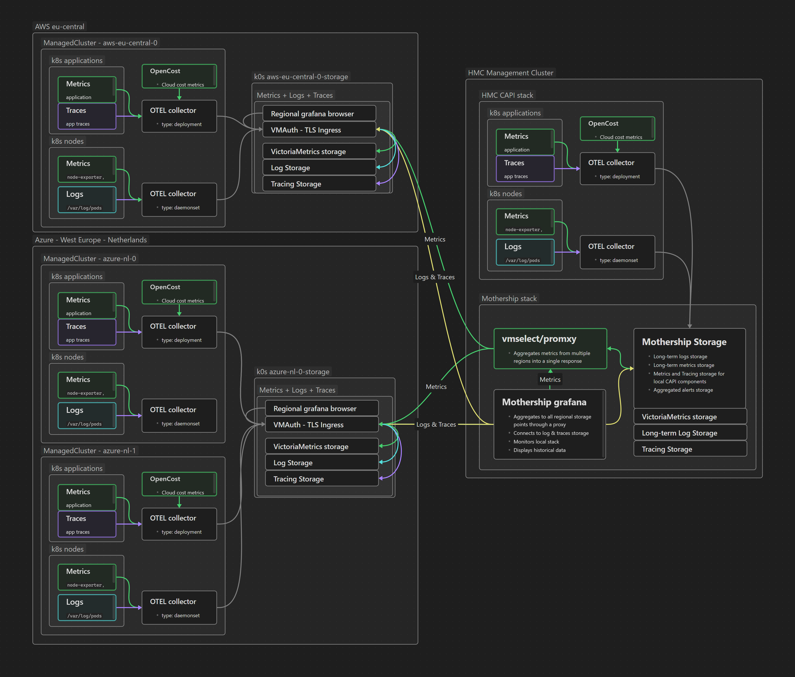

# Mirantis OpenTelemery
This repo contains 4 charts to deploy a monitoring stack using HMC and get metrics into storage clusters, data from which is then aggregated into single grafana interface.


## Mothership chart
* central grafana interface
* promxy to forward calls to multiple downstream regional metrics servers
* local victoriametrics storage for alerting record rules
* hmc helmchart definitions and service templates to deploy storage and collectors charts into managedclusters

### Demo deployment
In `demo/demo-mothership-values.yaml` set your target ingress names that you are going to use for your regional clusters, but they can always be changed after the fact

Create secrets for grafana admin user and storage clusters datasources endpoint access. By default the secret below be reused everywhere, but it is customizable.

```yaml
---
kind: Secret
apiVersion: v1
metadata:
  name: grafana-admin-credentials
  namespace: motel
stringData:
  GF_SECURITY_ADMIN_USER: username # Grafana username
  GF_SECURITY_ADMIN_PASSWORD: password # Grafana password
type: Opaque
```

```bash
helm repo add motel https://mirantis.github.io/motel/
helm repo update
helm upgrade -i motel motel/motel-mothership -n motel -f demo/demo-mothership-values.yaml
```

## Storage chart
* Grafana - region-specific Grafana instance, deployed and configured with grafana-operator
* vmcluster - metrics storage, ingestion, querying
* vmlogs - logs storage
* vmauth - auth frontend for metrics and logs ingestion and query services

#### Cluster requirements
- cert-manager
- ingress-nginx

To deploy storage `managedcluster` configure desired ingress names for vmauth and regional Grafana in it's values for the `motel-storage` template.
`demo/cluster/aws-storage.yaml` contains example definitions

```bash
kubectl apply -f demo/cluster/aws-storage.yaml
# you can check helm chart deployment status using ClusterSummary object:
kubectl get clustersummaries.config.projectsveltos.io -n hmc-system
```
Once the storage managedcluster is ready - retrieve its kubeconfig and get loadbalancer IP/DNS name for your ingress-nginx service.

```bash
kubectl get secret -n hmc-system aws-storage-kubeconfig -o jsonpath={.data.value} | base64 -d  > /tmp/hmc-aws-storage-kubeconfig.yaml
export KUBECONFIG=/tmp/hmc-aws-storage-kubeconfig.yaml
kubectl get svc -n ingress-nginx ingress-nginx-controller
```

With your preffered DNS hosting, set your ingress domains to resolve to that IP/DNS name, that's how the traffic will flow to/from regional cluster. 
To simplify this process it is posssible to enable [external-dns](https://kubernetes-sigs.github.io/external-dns/) helm chart deployment in values.

Once your domain is resolvable your Grafana and vmauth should be accessible.

## Operators chart
* opentelemetry-operator - [OpenTelemetry Operator](https://opentelemetry.io/docs/kubernetes/operator/)
* prometheus-operator-crds - [Prometheus Operator](https://github.com/prometheus-community/helm-charts/tree/main/charts/prometheus-operator-crds)

This chart pre-installs all required CRDs to create Opentelemetry Collectors for metrics and logs

## Collectors chart
* opentelemetry-collectors - [OpenTelemetry Collector](https://opentelemetry.io/docs/collector/) configured to monitor logs and metrics and send them to a storage cluster

To deploy operators and collectors to a `managedcluster` configure ingress names for storage vmauth in its values for the `motel-collectors` template.

```
kubectl apply -f demo/cluster/aws-managed.yaml
# you can check helm chart deployment status using ClusterSummary object:
kubectl get clustersummaries.config.projectsveltos.io -n hmc-system
```

Once your managed clusters are up, it should start pushing metrics and logs to your storage one, through ingress domain you've configured.
Check your storage cluster's Grafana for results first, then you should be able to see the same cluster in Grafana on the "mothership".

### Scaling up
* Deploy more managed clusters in a single region and point them to the existing storage victoria stack.
* Repeat the previous two steps for each desired region
* Update mothership chart configuration with every deployed regional stack to aggregate the data
